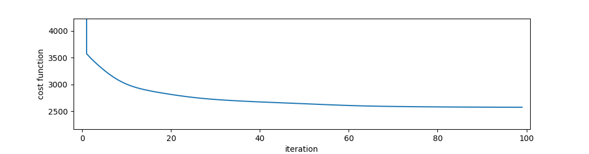

# WONTERFACT

## Overview
Wonterfact, or WONderful TEnsoR FACTorization, is a python package which provides a powerful tool to design any tensor factorization model and estimate the corresponding parameters.

This project has been initiated from 2015 to 2019 by Benoit Fuentes as a researcher in [Smart Impulse](https://www.smart-impulse.com/) R&D team.

## Features
 - It is a generalization of coupled tensor factorization, allowing to design an infinite number of models.
 - Many kind of operations can be used to design models: tensor multiplication, addition, integration, convolution, concatenation, etc.
 - Tensors to be factorized (i.e. observed tensors) can be either nonnegative or real-valued.
 - Each factor tensor of the model can be either nonnegative or real-valued, allowing to design semi-nonnegative models.
 - It is based on solid probabilistic framework: Poisson-based for nonnegative observed tensors or Skellam-based for real valued observed tensors.
 - Smooth constraints can be added to factors via prior distributions.
 - Hard linear equality or inequality constraints can be applied on factor tensors.
 - Two inference algorithms have been implemented: the Expectation-Maximization (EM) algorithm to find the posterior maximum of the parameters or the Variational Bayes EM (VBEM) algorithm to find an approximation of the posterior distributions of the parameters.
 - In VBEM mode, hyperparameters of the prior distributions can also be inferred.
 - In VBEM mode, wonterfact is a generalization of Latent Dirichlet Analysis (LDA).
 - Possibility to use cpu or gpu backend.


## References
For the moment, no article has been published yet to introduce this package and describe theoretical background on which it relies. Such an article should be published during the year 2021.


## Installation

### Requirements
Wonterfact only runs with python 3.8+.

[Graphviz](https://graphviz.org/) need to be installed to be able to render graphs of designed model (not necessary).

To be able to use wonterfact with gpu (optional), [CUDA](https://developer.nvidia.com/cuda-toolkit-archive) and `cupy` need to be installed (see [here](https://docs.cupy.dev/en/master/install.html) for cupy installation).
Wonterfact has only been tested with CUDA 10.2 and the corresponding `cupy` version:
```bash
pip install cupy-cuda102
```
It might work with other versions of CUDA (not tested).

For conda users who would prefer to "conda install" instead of "pip install" the main dependencies before installing wonterfact package (like numpy for instance), you can find the list of requirements in the "[tool.poetry.dependencies]" section of the `pyproject.toml` file.

### Installation of wonterfact
With `pip`:
```bash
pip install wonterfact
```

## Getting started: Nonnegative Matrix Factorization (NMF)
Wonterfact offers many possibilities, and mastering it requires time and effort (a full documentation as well as many tutorials should be released soon). However, once mastered, implementing and testing any tensor factorization model is quite simple and quick. We introduce here, by mean of a very simple example, the main principles of the use of wonterfact.

### Formulation of the model.
The goal of NMF is to find a good approximation of a nonnegative matrix *X*, that can be decomposed as the product of two nonnegative matrices *W* and *H*:. In some application of the NMF problem, *W* is called *atoms* and *H* is called *activations*, terms that will be kept in the following to refer these two factors. Moreover, the more generic term *tensor* can be used instead of *matrix*.

The first stage, and it is the main difficulty, in order to implement such a problem with wonterfact is to reformulate it with normalization constraints. It is not explained why here (there are some theoretical reasons) but factors need to be normalized in a specific way. We give here a step by step simple recipe to provide a valid normalization.

First, give names to each tensor index: . In wonterfact, tensors are identified with their indexes' names.

Then, add a scalar factor  to the model: . This scalar can be called *overall energy*.

Find normalization constraints on each factor so that the sum on all indexes of the left hand side expression, from which overall energy has been withdrawn, is equal to 1. Here, we want then . It can be verified that a valid normalization can be: .

A convenient convention to designate nonnegative tensors subject to normalization constraints is to use the same letter  for them, as well as the sign "|" for partial normalization: any tensor written for instance as  should verify  and . In this way, the model can be reformulated as: . All normalization constraints are implicitly express through the suggested convention and the name of the indexes are sufficient to identify the former *W* and *H* matrices. Generally, there is several ways to find a valid normalization for the factors, but they all respect the following rule: each index must be once and only once on the left side of the sign "|" (all indexes of a tensor subject to normalization constraint and not having a "|" sign are considered to be on the left side). Feel free to switch order of indexes in a given tensor if needed.

Eventually, the overall energy can be reintegrated in a full normalized tensor, i.e. not having the "|" sign, getting rid of this specific normalization constraint. Non-normalized tensors can be expressed with the letter  and  becomes then .


Finally, all intermediate operations should be expressed, so that multiplications of tensors have only two operands. In our case, it gives: .  are the activations and  the atoms.

### A graphical way to represent the model.

Before implementing the model with wonterfact, it is recommended to draw the tree of tensor operations. In this tree, *leaves* (i.e. nodes with no parents) correspond to the factors of the model, level 1 nodes, called *observers* are the tensors to be decomposed, the single *root* (level 0) is used to identify the whole tree and all other inner nodes, called *operators* correspond to tensors resulting from a specific operation of their parents nodes. The graphical representation of our current NMF model is as follow.


Nodes label correspond to the indexes of the tensors. Indexes are underlined to represent tensor not subject to normalization constraints (like ), and not underlined if they corresponds to normalized tensors such as ).

### Implementation with wonterfact

Implementing a tensor factorization model with wonterfact consists in performing some kind of literal translation of its graphical representation (like the one presented in previous section) in wonterfact language. There exists a specific class for each kind of node (leaves, operators, observers, etc.) and a users just need to know their name and attributes. We describe here how to make implement our NMF model. We will proceed bottom-up, starting from the root and ending with the leaves.

First off all, let us import needed packages, and define arbitrary dimensions for our problem:
```python
import wonterfact as wtf
import numpy as np
import numpy.random as npr
dim_f, dim_k, dim_t = 10, 3, 30
```

Then let us create the root. We recall that the root is used to represent the whole tree. Root object has many attributes, but all of them have default values and therefore are optionals. We will nevertheless specify a name for this node (it is not necessary but it can be quite useful for debugging when errors are raised), and the type of inference algorithm (here EM algorithm, which is the default value anyway). We will also specify that one want to compute the value of the cost function to minimize at each iteration (it is not necessary, but we will show you that this cost decreases over the iterations).
```python
my_tree = wtf.Root(name='root', inference_mode='EM', cost_computation_iter=1)
```

Now is time to create the observer. Since the tensor to be decomposed is nonnegative, the class `PosObserver` is used. To create a node that represents a tensor (i.e. all nodes but the root), it is necessary to provide the name of indexes in the write order via `index_id` attribute. The only convention you need to keep in mind, is that **the order of indexes must be reversed compared to the order on the graph representation** (an explanation will be given when the normalized leave representing atoms is instantiated). For observers object, the tensor to decompose is passed through the `tensor` attribute. We define here some random tensor.

```python
observer = wtf.PosObserver(
    name='observer',
    index_id='tf',  # could also define a tuple of strings like ('t', 'f')
    tensor=100 * npr.rand(dim_t, dim_f)
)
```

We can create the edge between the two nodes:

```python
observer.new_child(my_tree)
# my_tree.new_parent(observer)  # is equivalent
# wtf.create_filiation(observer, root)  # is also equivalent
```

Let us go further and define the node above the observer that represents the approximation . It is defined as the product of its two parents, therefore the class `Multiplier` is used. Only `index_id` attribute is necessary (do not forget to define indexes backwards).

```python
multiplier = wtf.Multiplier(name='multiplier', index_id='tf')
multiplier.new_child(observer)  # edge with its child
```

For the leaves, let us start with the one representing activations . This tensor has no normalization constraint, therefore the right class to use to represent it is `LeafGamma`. The reason for such a class name is that, in the probabilistic framework on which wonterfact relies, each coefficient of nonnegative tensor factors not subject to normalization constraints are considered as gamma random variables. There are two hyperparameters for gamma random variables: shape and rate. Those two hyperparameters can be specified during creation of the leaf with the two attributes `prior_shape` and `prior_rate`. Those hyperparameters are important since, besides allowing to add smooth constraints on the factors, they also define their initialization. Indeed, initialization is equal to the theoretical value that factors would take if observations were null (up to a minimum small *epsilon* value to avoid zero initialization), prior distribution being then the only contributor. Consequently, if hyperparameters are let to their default values (uniform prior) as it will be done in this example, default initialization is *epsilon* for `LeafGamma`'s tensor values. `tensor` attribute still need to be instantiate with the write shape.

```python
leaf_tk = wtf.LeafGamma(
    name='activations',
    index_id='tk',
    tensor=np.empty((dim_t, dim_k)),  # no need to initialize
    prior_shape=1,  # default value, meaning "uniform prior" over R
    prior_scale=0  # default value, meaning "uniform prior" over R
)
```

The last node to create is the leaf representing atoms . Since this tensor is subject to normalization constraint, the right class to use is `LeafDirichlet`, referring to the Dirichlet prior distribution. This distribution can be defined with the shape hyperparameters. Besides `index_id`, `tensor`, and `prior_shape` attributes, `LeafDirichlet` class needs a `norm_axis` attribute that specifies the axes on which the tensor has the normalization constraint. For a reason internal to wonterfact (related to the way numpy manages automatic broadcasting arrays), **it is necessary that normalization axes are the last axes of the tensor**, hence the convention to define indexes and tensors' shape backwards. Concerning the values of the shape hyperparameters, it cannot be left to default value (equals to 1, meaning uniform prior) because some randomness is needed in initialization (if not, each component of the NMF would converge towards the same limit). Therefore, we add small fluctuations above 1 for those hyperparameters. Random initialization could also be applied to activations instead of atoms, it is just an arbitrary choice.

```python
leaf_kf = wtf.LeafDirichlet(
    name='atoms',
    index_id='kf',
    norm_axis=(1, ),  # self.tensor.sum(axis=self.norm_axis) must be equal to 1
    tensor=np.empty((dim_k, dim_f)),  # no need to initialize
    prior_shape=1 + 1e-5 * npr.rand(dim_k, dim_f),  # very little fluctuations above 1
)
```

Finally, we create the last needed edges:
```python
leaf_tk.new_child(multiplier)
leaf_kf.new_child(multiplier)
# multiplier.new_parents(leaf_tk, leaf_kf)  # is equivalent
```

This is it, the NMF model is now instantiated. You can check if the tree of operations corresponds to the one you draw yourself (this is how we actually generated the figure in previous section):
```python
my_tree.draw(show_node_names=True, filename='nmf_tree.pdf')
```

You can use name you gave to each node (provided that each name is unique) to access to a particular node:
```python
leaf_kf == my_tree.atoms == my_tree.nodes_by_id['atoms']  # returns True
```

In order to estimate the parameters of the model (here atoms and activations), use the method `estimate_param` of your tree and decide on the number of iterations:
```python
my_tree.estimate_param(n_iter=30)
```
If you think you need more iterations, just call again the same method (stop and go mode). Algorithm might stop before the requested number of iterations if convergence has been reached.
```python
my_tree.estimate_param(n_iter=70)  # up to a total of 100 iterations
```

Plot cost function and observed its decrease:
```python
import matplotlib.pyplot as plt
plt.plot(my_tree.cost_record)
plt.xlabel('iteration')
plt.ylabel('cost function')
```


Get atoms and activations values:
```python
print(my_tree.atoms.tensor)
print(my_tree.activations.tensor)
```
